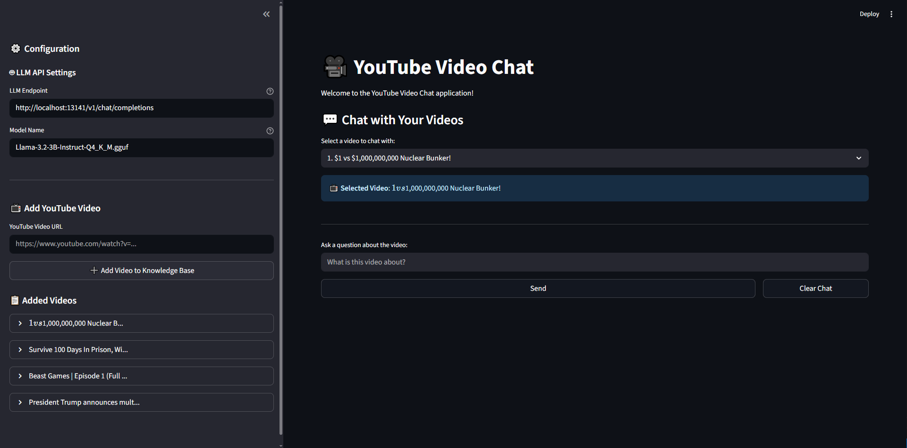
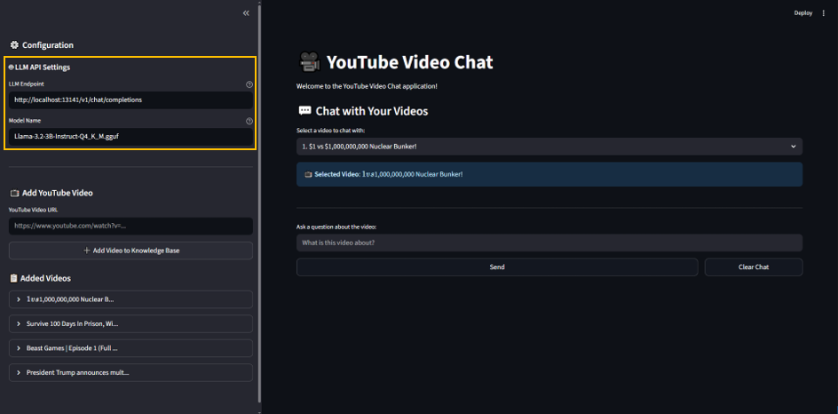
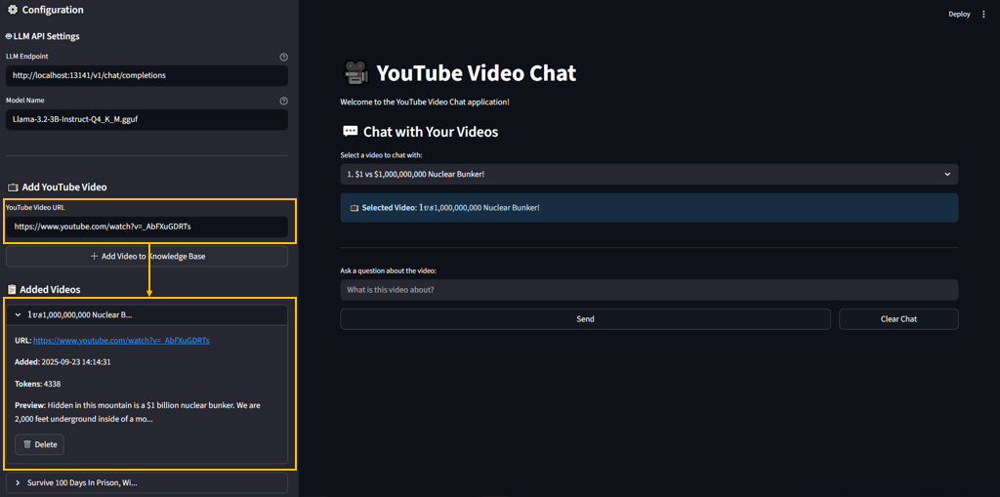

# Chat with YouTube Videos User Guide

## Overview
This application allows users to store video content in the KV Cache, enabling them to select specific videos for QA interactions. This functionality achieves quick responses from the LLM, enhancing the overall user experience.

---
## Chapter 1: Installation and Setting

### Installation Steps

1. Download the `Installer.zip` file and extract its contents.
2. Navigate to the `Installer` folder, your project structure should look like this:
```
Installer/
    ├── app.exe
    └── video_data.json (optional)
```
3. Launch the application by clicking on `app.exe`. The chat room will be automatically opened in your web browser.
---

## Chapter 2: How to Use?

### Usage Workflow

1. **Initial Setup**
- Click on `app.exe` to launch the chat interface. The chat room will be automatically opened at http://localhost:8501 (default). 


2. **Basic Operation**
- Fill in the **LLM Endpoint** and **Model Name** as required.


- Paste the YouTube video link to extract the video transcript (default is to prioritize extracting 'en', if unavailable then 'zh'). Successfully added videos will be displayed below.


- Choose the video you want to add to the conversation and start asking questions.


